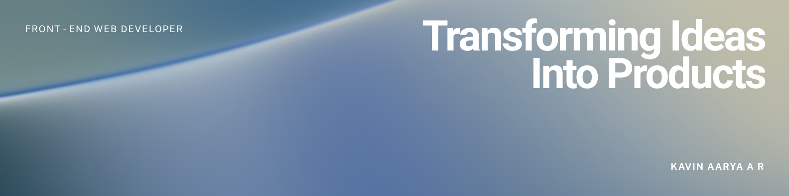

## Hi there, I'm Kavin Aarya 👋

I am a Java Full-Stack Developer focused on building practical web applications that solve everyday problems. On the backend, I use Spring Boot to build reliable architectures, which I pair with modern frontend technologies like React, JavaScript, and Tailwind CSS, alongside Artificial Intelligence features. Because I actively participate in competitive programming, I have a strong foundation in Data Structures and Algorithms (DSA), allowing me to write highly optimized and efficient code. I am always eager to learn new technologies and want to collaborate on projects that create useful, accessible software for everyone.

- 🤖 I’m currently working on a project to transform traditional doctor prescription methods.
- 🌐 I’m currently learning backend web technologies.
- 🏆 I’m a 2 ⭐️ CodeChef programmer (rating 1416), continuously improving my competitive programming and problem-solving skills.
- 💻 I'm a LeetCode programmer with 300+ problems solved across a wide range of data structures and algorithms.
  
## Languages and Framework

## Tools & Environment

<!--
**Kavin-Aarya/Kavin-Aarya** is a ✨ _special_ ✨ repository because its `README.md` (this file) appears on your GitHub profile.

Here are some ideas to get you started:

- 🔭 I’m currently working on ...
- 🌱 I’m currently learning ...
- 👯 I’m looking to collaborate on ...
- 🤔 I’m looking for help with ...
- 💬 Ask me about ...
- 📫 How to reach me: ...
- 😄 Pronouns: ...
- ⚡ Fun fact: ...
-->
